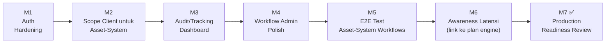

# Plan Pengerjaan — `Approval-Engine-Client`

Disusun setelah integrasi `asset-system-service` (main backend) selesai sampai Milestone 7
([lihat asset-system-service/docs/backend-milestones.md](../../asset-system-service/docs/backend-milestones.md)).

## Konteks penting: peran client ini berubah untuk kasus asset-system

Dari README repo ini sendiri, `Approval-Engine-Client` didesain sebagai **portal approver
umum** (inbox, request detail, keputusan approve/reject) untuk *consuming app apa pun* yang
memakai `Approval-Engine-Service`. Tapi untuk integrasi `asset-system-service`, keputusan
produk yang sudah dikonfirmasi (lihat
[approval-engine-integration-plan.md §0](../../asset-system-service/docs/approval-engine-integration-plan.md))
adalah:

> `Approval-Engine-Client` hanya dipakai untuk mendokumentasikan/memantau status approval,
> bukan untuk aksi approve/reject oleh user asset-system. Approver bertindak lewat
> `asset-system-frontend` → main backend → engine.

Konsekuensinya: fitur **Inbox + Decision** yang sudah ada di client ini secara teknis tetap
berfungsi untuk request dari `asset-system` (karena sama-sama hit engine yang sama), tapi
**tidak boleh dipakai untuk itu** — kalau seorang approver asset-system kebetulan login ke
portal ini dan approve dari sini, hasilnya sah di engine tapi mem-bypass UX/notifikasi yang
sudah dibangun di `asset-system-frontend`. Plan ini memperlakukan client sebagai **admin +
audit tool** untuk lingkup asset-system, bukan menghapus fitur approver-nya (karena masih
dipakai consuming app lain).

## Temuan tambahan dari README repo ini sendiri

- Auth "deliberately light": login cuma NIK yang diketik, disimpan di `localStorage`, tanpa
  verifikasi identitas apa pun. Cukup untuk demo, **tidak cukup** begitu keputusan yang
  dibuat di sini berpengaruh nyata ke request asset-system.
- README sudah mengakui sendiri: "a single decision involves several sequential round trips
  to a remote Turso replica" — konsisten dengan temuan latensi ~2.1s yang diukur dari sisi
  `asset-system-service` (lihat plan `Approval-Engine-Service`).

## Milestone

### Milestone 1 — Auth Hardening

**Tujuan:** login berbasis NIK-ketik-manual tidak cukup begitu client ini dipakai untuk
mengelola workflow yang menentukan approval chain request sungguhan.

**Tasks:**
- [ ] Ganti/lengkapi `CurrentUserContext` dari sekadar NIK-di-localStorage ke autentikasi
      nyata (minimal: password, idealnya SSO kalau organisasi punya).
- [ ] Batasi siapa yang boleh akses halaman Workflow CRUD & Applications (admin/system-support
      saja) — README `Approval-Engine-Service` sudah menyebut endpoint ini belum ada role
      gate di backend; begitu Milestone 2 di plan engine selesai (auth admin di backend),
      client ini perlu diupdate untuk mengirim kredensial admin yang sesuai.

**Dependency:** `Approval-Engine-Service` plan Milestone 2 (Authorization untuk Admin
Endpoints) — client tidak bisa mengirim kredensial admin yang belum didefinisikan backend-nya.

**DoD:** halaman admin (workflow/application management) tidak bisa diakses tanpa autentikasi
yang lebih kuat dari NIK bebas ketik.

### Milestone 2 — Scope Client untuk Asset-System

**Tujuan:** cegah kebingungan operasional — approver asset-system tidak boleh terbiasa
approve dari sini.

**Tasks:**
- [ ] Tambahkan indikator jelas di UI Inbox/RequestDetail kalau sebuah request berasal dari
      `app_id` asset-system (`doc_type` diawali `asset_request_`) — beri banner/label
      "Approval untuk request ini seharusnya dilakukan lewat Asset System, bukan di sini"
      alih-alih menyembunyikan/mem-block sepenuhnya (masih berguna untuk debugging admin).
- [ ] Diskusikan dengan tim: apakah field aksi approve/reject perlu di-disable total untuk
      `doc_type` milik asset-system di level UI (bukan backend — backend tetap harus terima
      keputusan dari client mana pun, itu sudah benar by design), supaya tidak ada jalur ganda
      yang membingungkan user.

**DoD:** tidak ada ambiguitas UI soal "approve di sini atau di Asset System" untuk request
asset-system.

### Milestone 3 — Audit/Tracking Dashboard

**Tujuan:** ini peran utama client untuk asset-system sekarang — lihat status approval tanpa
approve dari sini.

**Tasks:**
- [ ] Tambah pencarian request berdasarkan `resource_id` (format `REQ-XXXXXXXX` milik
      asset-system) — saat ini portal terorganisir sekitar inbox per-NIK, belum tentu ada
      cara cepat cari "status approval untuk REQ-XXXXXXXX ini apa".
  - [ ] Sertakan `app_id`/`doc_type` di hasil pencarian supaya jelas request ini dari sistem
      mana.
- [ ] Tampilkan riwayat step + assignment lengkap (siapa approve, kapan, comment) untuk
      keperluan audit — data ini sudah ada di `GET /requests/:id`, tinggal dipastikan
      ter-render lengkap di halaman detail.

**DoD:** admin/support bisa cari status approval request asset-system tertentu tanpa perlu
tahu NIK approver-nya lebih dulu.

### Milestone 4 — Workflow Admin Polish

**Tujuan:** 2 workflow yang dipakai asset-system (`asset_request_barcode`,
`asset_request_field_device` — lihat Fase 0 di plan integrasi asset-system) dikelola dengan
mudah lewat editor step dinamis yang sudah ada.

**Tasks:**
- [ ] Verifikasi UI editor step bisa merepresentasikan pola `condition` yang dipakai
      asset-system (`requesterApprovalRank` dengan operator `lt`) — bukan cuma pola
      `same_department`/kategori yang mungkin jadi fokus desain awal.
- [ ] Tambah preview/simulasi: masukkan `requesterApprovalRank` contoh, tampilkan step mana
      yang akan aktif/skip — membantu system-support verifikasi workflow baru tanpa harus
      create request sungguhan tiap kali uji coba.
- [ ] Pastikan versioning workflow (edit = publish versi baru, versi lama tetap dipakai
      request yang sedang berjalan) jelas terlihat di UI, supaya admin tidak kaget request
      lama "tidak berubah" setelah workflow di-edit.

**DoD:** system-support bisa mengelola & memverifikasi workflow asset-system tanpa bantuan
developer.

### Milestone 5 — E2E Test untuk Workflow Asset-System

**Tujuan:** suite Playwright yang sudah ada (`e2e/workflow-crud.spec.ts`, dll) memvalidasi pola
generik — tambahkan skenario spesifik yang mencerminkan setup asset-system sungguhan.

**Tasks:**
- [ ] Skenario E2E: publish workflow dengan `condition` `requesterApprovalRank` (bukan cuma
      `same_department` yang sudah ada), verifikasi step di-skip/aktif sesuai payload.
- [ ] Skenario E2E: cari & lihat detail request lewat `resource_id` (hasil Milestone 3).

**DoD:** `npm run test:e2e` hijau, mencakup pola workflow asset-system secara eksplisit, bukan
cuma pola generik yang sudah ada.

### Milestone 6 — Awareness Latensi

**Tujuan:** README sudah mengakui latensi tinggi — pastikan UX portal tidak terasa "macet"
tanpa penjelasan.

**Tasks:**
- [ ] Tambah loading state yang jelas (bukan cuma spinner default) untuk aksi decision/create
      yang diketahui makan waktu beberapa detik.
- [ ] Link temuan ini ke plan `Approval-Engine-Service` Milestone 1 (Performance
      Investigation) — perbaikan sesungguhnya ada di sana, bukan di client.

**DoD:** user tidak salah kira aplikasi hang saat menunggu response engine yang lambat.

### Milestone 7 ✅ — Production Readiness Review

**Tujuan:** keputusan go/no-go sebelum system-support benar-benar pakai portal ini untuk
kelola workflow asset-system di production.

**Tasks:**
- [ ] Semua milestone 1–6 selesai.
- [ ] Demo bersama tim asset-system: buat/edit workflow lewat portal ini, verifikasi hasilnya
      langsung berlaku untuk request baru dari `asset-system-frontend`.
- [ ] Konfirmasi tidak ada approver asset-system yang perlu akun di portal ini (sesuai scope
      Milestone 2) — kalau ternyata perlu, revisit keputusan produk di plan integrasi
      asset-system.

**DoD (= selesai):** system-support bisa mengelola workflow & audit request asset-system lewat
portal ini secara mandiri, tanpa jalur approval ganda yang membingungkan.
